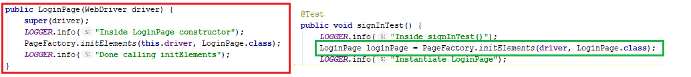
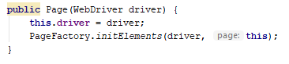

# The Design

The demo Application Under Test (AUT) url would be: http://newtours.demoaut.com/

## FEATURE001 Drivers

`com.lemsst.bangsamoro.core.driver`

This sub-package will manage WebDriver objects. This will use Factory Design pattern. The design is largely based on [this article](https://www.logigear.com/blog/test-automation/building-a-selenium-framework-from-a-to-z/).

### TODO

1. Desired capabilities
2. Remote
3. Other browsers

## Data 

`com.lemsst.bangsamoro.core.data`

Will support test data coming from Excel, etc.

## Reports

## Waits

TLDR;

> Forget that Implicit Wait exists! :p

Refer to https://www.seleniumhq.org/docs/04_webdriver_advanced.jsp

Refer to the answers in https://stackoverflow.com/questions/10404160/when-to-use-explicit-wait-vs-implicit-wait-in-selenium-webdriver

## Parallel Execution

## Remote Execution

## Page Object Model

`com.lemsst.bangsamoro.core.pom.withpagefactory`

> A design pattern - not a framework [1]

### The problem statement [1]

A web page has 'x' no. of elements, which are used in multiple test cases.
Now if the path/locator of any element changes, then what happens?

### Solution
    
Separate the element locator from the Test case
    
| PageClass |
|------------|
|-driver:WebDriver|
|-element1: By|
|-element2: By|
|+PageClass(driver:WebDriver)|
|+operationsOnElements()|

| Test Class |
|------------|
|Calls methods in Page Class|

### Bot-Style Test [Design Pattern]

See https://github.com/SeleniumHQ/selenium/wiki/Bot-Style-Tests

### Page Factory [Design pattern]
`import org.openqa.selenium.support.PageFactory`

- Built-in Selenium class
- `@FindBy`
- `@CacheLookup`
- [[1] Selenium Page Object Model Using Page Factory | Selenium Tutorial For Beginners | Edureka](https://www.youtube.com/watch?v=gBdKv3qeBIM)
- [[2] PageFactory](https://github.com/SeleniumHQ/selenium/wiki/PageFactory)
- [[3] Page Objects](https://raw.githubusercontent.com/wiki/SeleniumHQ/selenium/PageObjects.md)

## FEATURE002 Cucumber Integration (Annotations) [IN PROGRESS]

### TODO:
- Read https://rlogiacco.wordpress.com/2016/01/18/cucumber-is-not-a-testing-framework/

### ISSUES
- How to run Cucumber features via mvn?

## Cucumber Integration (Java 8 Lambda Expressions)

## Taking Screenshots

## testng.xml Settings

## Logging
- Use `LogManager.getLogger(DriverFactory.class.getName());` not `LogManager.getLogger(DriverFactory.class);`
- Read https://howtodoinjava.com/log4j2/log4j-2-xml-configuration-example/

## All Exceptions Encountered

- ISSUE-001 | `Caused by: java.lang.OutOfMemoryError: Java heap space`. @BeforeClass and @AfterClass are called but the @Test method is not.
    - Resolution: PageFactory.initElements was used incorrectly.
        - 
            - The real resolution is 
                - 