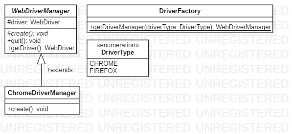

# The Design

## Drivers

`com.lemsst.bangsamoro.core.driver`

This sub-package will manage WebDriver objects. This will use Factory Design pattern. The design is largely based on [this article](https://www.logigear.com/blog/test-automation/building-a-selenium-framework-from-a-to-z/).

### TODO

1. Desired capabilities
2. Remote
3. Other browsers

## Data 

`com.lemsst.bangsamoro.core.data`

Will support test data coming from Excel, etc.

## Reports

## Waits

TLDR;

> Forget that Implicit Wait exists! :p

Refer to https://www.seleniumhq.org/docs/04_webdriver_advanced.jsp

Refer to the answers in https://stackoverflow.com/questions/10404160/when-to-use-explicit-wait-vs-implicit-wait-in-selenium-webdriver

## Parallel Execution

## Remote Execution

## Page Object Model

## Cucumber Integration

## Taking Screenshots
